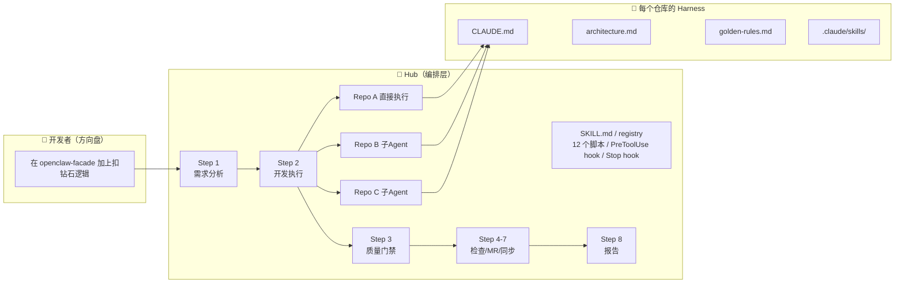
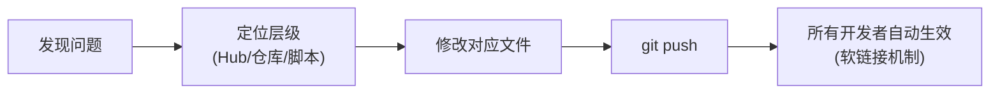
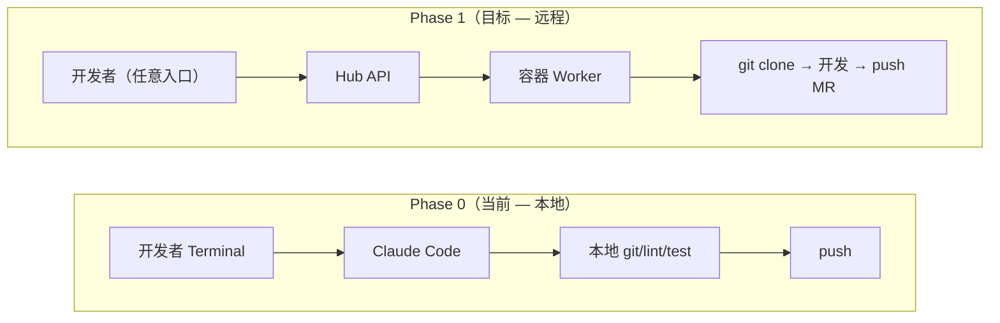
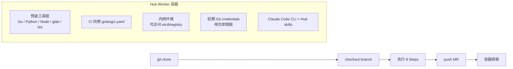
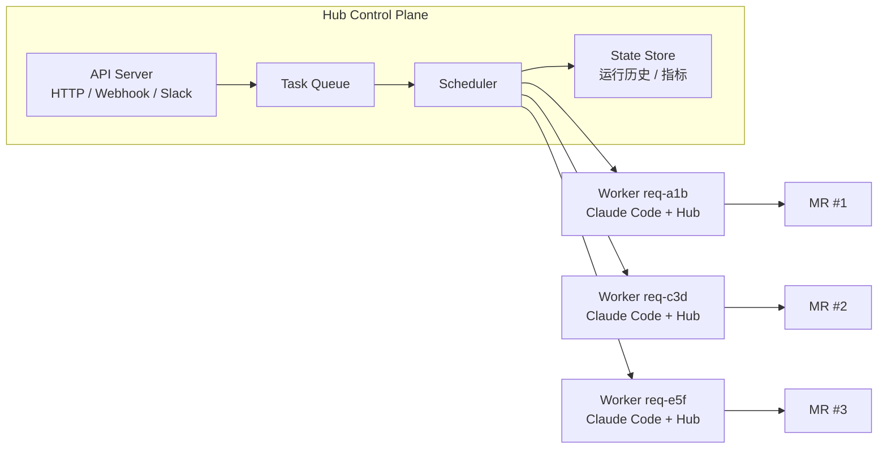
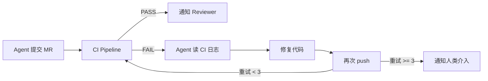
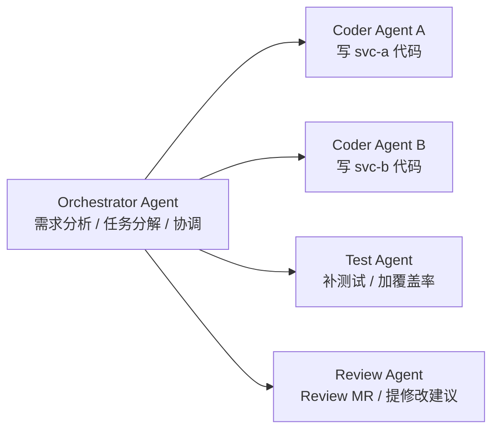
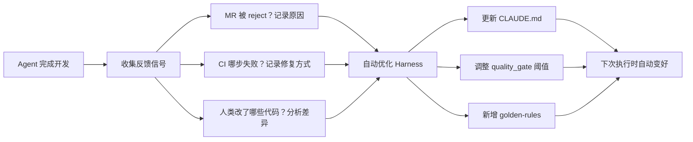

# Weaver Harness Hub — 完整指南

## 我们在做什么

我们在构建一套系统，让 AI Agent 像一个真实的高级开发者一样完成从需求理解到部署上线的全流程。

传统的 AI 辅助编程是"人写代码，AI 补全"。我们的方向相反：**Agent 是主要的代码作者，人类是方向盘**。开发者描述需求，Agent 分析涉及哪些服务、编写代码和单元测试、通过质量门禁、提交 MR、部署到测试环境。开发者 review 和验证。

这个理念来自 OpenAI 提出的 **Harness Engineering**——为 AI Agent 构建一套完整的工程环境（harness），使它能独立、高质量地完成开发任务。Harness 不是一个服务，而是一套文档、脚本、规则和工作流的组合，嵌入在每个仓库和全局编排层中。

---

## 核心设计原则

### 1. 复刻真实开发者的完整流程

一个需求从提出到上线，真实开发者会做什么？


Hub 的 8 个 Step 就是这个流程的完整映射。每一步都不能跳过，和真实开发一样。

### 2. 机械的归脚本，判断的归 Agent

| 需要判断力的（Agent 做） | 机械重复的（脚本做） |
|------------------------|-------------------|
| 理解需求，识别涉及的服务 | 检测仓库语言和构建系统 |
| 阅读代码，理解架构 | 运行 lint、测试、覆盖率检查 |
| 编写代码和测试 | 检查工作区是否干净、有无冲突标记 |
| 修复 lint/测试失败 | 推送分支、创建 MR |
| 分析文档漂移并修复 | 检测文件变更分类 |

脚本的好处：**确定性**（同样的输入永远产出同样的结果）和**不会遗漏**（不依赖 Agent 记住要做什么）。

### 3. 多层防护，不依赖 Agent 自觉

Agent 可能写完代码就觉得"做完了"。我们用三层防护确保流程完整：

| 层次 | 机制 | 作用 |
|------|------|------|
| **指令层** | SKILL.md 中的强制清单和"→ 不要停"过渡 | 引导 Agent 按顺序执行 |
| **门禁层** | `quality_gate.sh` + `pre_mr_check.sh` | 机械检查代码质量和提交就绪 |
| **拦截层** | `hub_pre_tool_hook.sh`（PreToolUse hook） | 物理阻断危险命令：删除测试文件、手动 git push、伪造状态标记 |
| **兜底层** | `hub_stop_hook.sh`（Stop hook） | Agent 想停时检查每个服务的 Step 2-6 状态标记是否完成，未完成则 exit 2 阻断，最多 20 次 |

---

## 架构全景



### Hub 是什么形态？

Hub **不是一个运行的服务**，而是一组 Claude Code skill 文件 + 脚本 + hooks，通过 marketplace plugin 或软链接安装。它存在于一个 git 仓库中，开发者 `git pull` 即可获取更新。首次使用时 `install_hooks.sh` 自动将 PreToolUse 和 Stop hook 注册到用户的 `~/.claude/settings.json`。

---

## 完整工作流：8 个 Step

### Step 1：需求分析

**输入**：开发者的自然语言需求描述

**Agent 做的事**：
- 读取 registry 仓库中所有已注册服务的描述、暴露的 API（`exposes`）和依赖关系（`consumes`）
- 判断哪些服务需要改动
- 为每个服务生成代码级别的子任务描述
- 判断并行/串行：**默认并行**（各服务代码改动独立），只有字面依赖产物时（A 生成 IDL → B 必须用）才串行
- 生成需求 ID（`req-<6位字符>`），用于统一分支命名
- 安装 hooks（`install_hooks.sh`，首次自动安装，后续幂等跳过）
- 创建流程标记文件 `/tmp/.claude_hub_active`（包含 `services:` 列表和每个服务的 `svc_<name>_repo/base` 信息，Stop hook 依赖此文件）

**向用户确认后才开始执行**，避免理解偏差。

**单服务优化**：如果只涉及一个服务，跳过多服务编排，直接进入 Step 2。

### Step 2：执行开发

这是最核心的一步，模拟真实开发者的编码过程。

**当前仓库**（Agent 直接执行）：

| # | 动作 | 说明 |
|---|------|------|
| 1 | 读 CLAUDE.md | 了解仓库结构、命令、代码规范 |
| 2 | 创建分支 | `git checkout -b test/lane/<req-id> origin/<base_branch>` |
| 3 | 编写代码 | 实现需求功能或修复 bug |
| 4 | 编写单测 | 查找已有测试文件模仿风格，覆盖核心逻辑和边界条件 |
| 5 | 运行 lint | `commands.check`（从 registry 服务配置读取） |
| 6 | 运行单测 | `commands.test`，确认新写的测试通过 |
| 7 | 失败修复 | lint 或测试失败时修复后重跑，最多 20 轮 |
| 8 | 格式化 | `commands.format` |
| 9 | commit | 代码和测试放同一个 commit |

**其他仓库**（派发子 Agent）：

Hub 通过 Claude Code 的 Agent tool 派发子任务，子 Agent 进入目标仓库执行同样的 9 步流程。多个不相互依赖的服务可以**并行执行**。

### Step 3：质量门禁

**脚本**：`quality_gate.sh`

三道门禁，全部通过才能继续：

| 门禁 | 检查内容 | 失败后果 |
|------|---------|---------|
| lint_check | lint + 类型检查 + 架构约束 | 阻断 |
| unit_test | 单元测试全部通过 | 阻断 |
| coverage (增量) | **变更代码**的测试覆盖率 ≥ 阈值（默认 80%），不检查全量 | 阻断 |

覆盖率只检查相对 `base_branch` 变更的源文件，不检查全量覆盖率。这避免了在大型老项目（历史代码无测试）中永远无法通过门禁的问题。

失败时 Agent 阅读报告，修复后重跑，最多 20 轮。

### Step 4：MR 就绪检查

**脚本**：`pre_mr_check.sh`

8 项检查，确保提交前一切就绪：

| 检查 | 说明 | 级别 |
|------|------|------|
| branch_current | 在正确的分支上 | 阻断 |
| working_tree_clean | 无未提交变更 | 阻断 |
| has_commits | 有 commit | 阻断 |
| format_check | 代码已格式化 | 阻断 |
| test_files_included | 改动中包含测试文件 | 警告 |
| commit_message | commit message 格式正确 | 警告 |
| no_conflict_markers | 无冲突标记 | 阻断 |
| no_sensitive_files | 无 .env/credentials 等敏感文件 | 阻断 |

### Step 5：提交 MR

**脚本**：`create_mr.sh`

脚本始终先 push 分支，然后根据 glab 可用性选择模式：

| 模式 | 条件 | 行为 |
|------|------|------|
| glab 模式 | `glab` 已安装且已认证 | 自动创建 MR（标题 `[Hub req-<id>] <简述>`，标签 `agent-generated, req:<id>`） |
| push-only 模式 | `glab` 未安装或未认证 | 只 push，输出手动创建 MR 的链接 |

两种模式都会写入状态标记，Stop hook 都认可。MR 描述模板包含需求摘要、改动说明、关联的其他服务 MR 链接。

**⚠️ Agent 不能手动 `git push`**（PreToolUse hook 物理阻断），必须通过此脚本。脚本还会校验目标分支（`base_branch`）是否存在，防止 MR 提给错误的分支。

### Step 6：同步 Harness 文档

**脚本**：`detect_drift.sh` + `update_sync_state.sh`

开发过程中代码结构可能变了（新增模块、改了路由、改了构建配置），但 CLAUDE.md 和架构文档还是旧的。这一步检测并修复这种"漂移"：

1. 脚本对比开发前后的文件变更，分类（结构/构建/路由/IDL/CI）
2. 检查每个 harness 文件是否需要更新
3. Agent 阅读变更的代码，增量修补文档
4. 更新同步基线

### Step 7：泳道部署

所有服务使用相同的 `test/lane/<req-id>` 分支名。CI 自动将同名分支部署到同一个泳道环境 `_lane_<req-id>`，使跨服务的改动可以在隔离环境中联调验证。

### Step 8：汇总报告

输出结构化报告，包含每个服务的执行状态、MR URL、泳道信息和后续步骤。清除流程标记文件。

---

## 服务注册表（Registry）

服务注册表存放在独立的 GitLab 仓库 `harness-hub-registry`，每个服务一个 YAML 文件：

```
harness-hub-registry/
└── services/
    ├── openclaw-facade.yaml
    ├── pay-wallet.yaml
    └── ...
```

每个服务文件格式：

```yaml
# service-name.yaml（无顶层 services: key，直接写字段）
repo: gitlab.example.com:team/service       # 仓库地址（local_path 由 hub_config.sh 从当前仓库路径自动推导）
base_branch: main                            # 基准分支（MR 目标、覆盖率基线）
description: "服务职责描述"                    # Hub 用这个理解服务做什么
language: go                                  # 主要语言
build_system: go                              # 构建系统
commands:
  check: "golangci-lint run -v"               # lint/类型检查
  test: "go test ./..."                       # 单元测试
  format: "git diff --name-only origin/main -- '*.go' | xargs -r goimports -w"
  install: "go mod tidy"                      # 安装依赖
quality_gate:
  coverage_threshold: 80                      # 增量覆盖率门禁（只检查变更文件）
exposes:                                      # 暴露的 API
  - name: api-name
    type: http/thrift/grpc/mcp
    description: "API 描述"
consumes:                                     # 依赖其他服务的 API
  - other-service/api-name
```

注册新服务通过向 registry 仓库提 MR，由 `/hub-init` 自动完成。

**`base_branch` 很重要**：同一仓库可以有不同主分支（如 `chat-agent` 的 `main` 和 `claw`），MR 目标、覆盖率计算、commit 统计都基于此字段。脚本会校验该分支在远端是否存在。

**`format` 命令建议只格式化变更文件**（`git diff --name-only | xargs`），避免格式化整个仓库导致不相关的文件变更。

**`exposes` + `consumes` 构成服务依赖图**，Hub 用它判断需求涉及哪些服务和运行时依赖关系。

---

## 每个仓库的 Harness

每个接入 Hub 的服务仓库需要以下文件（由 `/hub-init` 自动生成）：

| 文件 | 作用 | 谁读它 |
|------|------|-------|
| `CLAUDE.md` | 仓库导航：快速命令、目录结构、代码规范 | Agent 进入仓库时第一个读的文件 |
| `docs/architecture.md` | 模块结构、分层规则、数据流、外部依赖 | Agent 决定代码放在哪里 |
| `docs/golden-rules.md` | 代码不变式：不能违反的规则 | Agent 编码时的约束 |
| `.claude/skills/` | 仓库级工作流（fix-bug, new-feature 等） | 直接在仓库开发时的流程指导 |

**这些文件的质量直接决定 Agent 的开发质量。** CLAUDE.md 写得好，Agent 就知道该跑什么命令、代码放在哪、测试怎么写。写得差，Agent 就会乱来。

---

## 安装和使用

### 首次安装（每个开发者执行一次）

```bash
# 1. 确保 matrix 仓库已 clone
git clone <matrix-repo-url> ~/go_repos/src/matrix

# 2. 安装 plugin（通过 Claude Code marketplace）
# 或手动创建软链接到 ~/.claude/skills/

# 3. 安装 hooks（一次性，后续幂等）
bash ~/go_repos/src/matrix/plugins/skills/weaver_harness_hub/scripts/install_hooks.sh
```

`install_hooks.sh` 自动完成：
- 将 PreToolUse hook（`hub_pre_tool_hook.sh`）注册到 `~/.claude/settings.json`
- 将 Stop hook（`hub_stop_hook.sh`）注册到 `~/.claude/settings.json`
- 幂等安全，重复运行不会重复添加
- Hook 只在 hub 流程激活时（`/tmp/.claude_hub_active` 存在）生效，不影响日常操作

> 如果通过 `/hub-init` 或 `/hub` 触发，hooks 会在 Step 1 自动安装，无需手动执行。

### 接入新仓库

在目标仓库目录中打开 Claude Code：

```
/hub-init
```

Agent 会自动检测仓库信息、深度阅读源代码、生成 harness 文件、注册到 registry 仓库。

### 日常开发

在任意已注册的仓库目录中，直接描述需求：

```
在 openclaw-facade 加上用户发消息扣钻石的逻辑，每条消息扣 1 个钻石
```

Hub 自动触发，从需求分析到部署一条龙。

### 文档同步

代码改了但文档没跟上？

```
/hub-sync
```

脚本检测漂移，Agent 修复文档。

### 更新 Hub

```bash
cd ~/go_repos/src/matrix
git pull
```

因为是软链接，pull 之后所有开发者立即获得最新的 skill 和脚本。

---

## 脚本清单

| 脚本 | 用途 | 在哪一步调用 |
|------|------|------------|
| `hub_config.sh` | 配置解析工具（零配置）：拉取 registry、自动推导 local_path | 所有步骤的基础 |
| `detect_repo.sh` | 自动检测仓库语言、框架、命令、API | hub-init Phase 1 |
| `register_service.sh` | 注册服务到 registry 仓库 | hub-init Phase 5 |
| `install_hooks.sh` | 一键安装 PreToolUse + Stop hook 到 `~/.claude/settings.json` | hub Step 1 / hub-init Phase 4.6 |
| `quality_gate.sh` | 质量门禁（lint + test + 增量 coverage），写 `svc_<name>_step3` 标记 | hub Step 3 |
| `pre_mr_check.sh` | MR 就绪检查（8 项），写 `svc_<name>_step4` 标记 | hub Step 4 |
| `create_mr.sh` | 推送分支 + 创建 MR（glab 或 push-only），写 `svc_<name>_step5` 标记 | hub Step 5 |
| `detect_drift.sh` | 检测 harness 文档漂移，自动从仓库 `docs/harness-sync-state.yaml` 读基线 | hub Step 6 / hub-sync |
| `update_sync_state.sh` | 更新仓库的同步基线（写入 `docs/harness-sync-state.yaml`） | hub Step 6 / hub-sync / hub-init |
| `lane_status.sh` | 查询泳道部署状态 | hub Step 7 |
| `hub_pre_tool_hook.sh` | PreToolUse hook，阻断删除测试/手动 push/伪造标记/删除状态文件 | 每次 Bash 命令前自动触发 |
| `hub_stop_hook.sh` | Stop hook，遍历所有服务检查状态标记，阻止提前停止，验证通过后清除状态文件 | 每次 Agent 停止时自动触发 |

---

## 如何迭代和优化

Hub 做得不够好？根据问题改对应的文件：

| 问题现象 | 根因 | 改什么 |
|---------|------|-------|
| 需求分析漏了服务 | registry 中服务描述不够详细 | 补充 `description`、`exposes`、`consumes` |
| Agent 在某个仓库里写的代码质量差 | 该仓库的 harness 文件不够好 | 改该仓库的 `CLAUDE.md`、`docs/architecture.md` |
| Agent 不写单测 | Stop hook 检查测试文件 + 增量覆盖率门禁 | 已有机械化防护，覆盖率不达标则阻断 |
| Agent 跳步骤 | Stop hook 检查每个服务的状态标记 | 检查 `install_hooks.sh` 是否执行过、确认 hooks 生效 |
| 编排流程有问题 | Hub 的工作流设计有缺陷 | 改 Hub 的 `SKILL.md` |
| 质量门禁太松/太严 | 阈值或检查逻辑不对 | 改 `quality_gate.sh` 或 registry 服务文件的 `coverage_threshold` |
| 新的工作流类型 | 缺少对应的 skill | 在各仓库的 `.claude/skills/` 里加新 skill |
| 脚本检测不准 | 脚本逻辑缺陷 | 改对应的脚本（detect_repo.sh 等） |

### 迭代流程



### 关键认知

- **CLAUDE.md 是最重要的文件**。Agent 进入仓库后第一件事就是读它。写好 CLAUDE.md，相当于给 Agent 一个资深同事的口头交接。
- **registry 服务文件的 description 决定需求路由质量**。描述越准确，Hub 越不容易漏服务或错分任务。
- **脚本是兜底**。Agent 可能忘记跑 lint，但脚本不会。脚本是确定性的保障层。
- **Hub 是活的**。它会随着使用不断优化——每次 Agent 做得不好，都是一次改进 harness 的机会。

---

## FAQ

**Q: Hub 和直接用 Claude Code 写代码有什么区别？**

直接使用 Claude Code 时，Agent 只看到当前仓库，没有全流程保障。Hub 在此基础上增加了：跨服务编排（并行开发）、强制质量门禁（增量覆盖率）、MR 自动化（glab / push-only 双模式）、文档同步（漂移检测）、泳道部署，以及四层防偷懒机制（指令层 / 门禁层 / PreToolUse 拦截层 / Stop hook 兜底层）。

**Q: 必须走 Hub 吗？**

不是。简单的改动可以直接在仓库里用 `/fix-bug` 或 `/new-feature`。Hub 的价值在完整的需求开发流程——从理解到部署。

**Q: 新增一个微服务怎么接入？**

在新仓库目录中运行 `/hub-init`。Agent 自动检测、阅读代码、生成文档、注册到 registry 仓库。

**Q: 跨服务需求怎么保证一致性？**

所有服务使用相同的分支名 `test/lane/<req-id>`，CI 将同名分支部署到同一个泳道。Hub 会按依赖顺序执行，确保上游先完成。

**Q: Agent 写的代码能信吗？**

代码要通过三道检查（lint + 单测 + 覆盖率 ≥ 80%）+ 八项就绪检查 + 人类 MR review 之后才能合入。Hub 保证的是流程完整性，代码正确性靠门禁和 review 共同保障。

**Q: Stop hook 会不会导致 Agent 死循环？**

不会。hook 在标记文件中维护 retry_count 计数器，每次阻断递增。达到 20 次后强制放行并清除标记文件，防止死循环。

**Q: Agent 能绕过防护机制吗？**

极难。四层防护互相兜底：
- **PreToolUse hook** 物理阻断危险命令（删测试、手动 push、伪造标记），Agent 无法执行这些命令
- **状态标记**由脚本内部写入（`svc_<name>_step3` 等），Agent 直接写会被 PreToolUse hook 拦截
- **Stop hook** 遍历每个服务检查所有标记，Agent 声称完成但标记不全就无法停止
- 唯一无法机械化验证的是**测试质量**（Agent 可能写空测试），这需要人类 MR review 兜底

**Q: 多服务需求时，一个服务的脚本失败会影响其他服务吗？**

不会。所有脚本（quality_gate / pre_mr_check / detect_drift）始终 exit 0，结果通过输出文本（verdict）传达。这样并行执行时，一个服务的门禁失败不会取消其他服务的并行调用。

---

## 演进路线

Hub 当前是 **Phase 0：本地 CLI 模式**。以下是我们规划的演进方向。

### Phase 1：Remote Execution（远程执行）

**核心变化**：Agent 不再跑在开发者的笔记本上，而是跑在云端容器里。



**为什么要做这个？**

本地执行的痛点在这次测试中已经暴露得很清楚：
- 工具链缺失（glab 没装、golangci-lint 版本不对）
- 环境差异（本地 lint config 和 CI 不一致）
- 外部依赖（rpccli init() 需要连 etcd，本地连不上）
- 并行受限（一个 terminal 只能跑一个 Agent）

容器化解决所有这些问题：



**架构**：



**开发者体验变化**：

```
# 今天（本地 CLI）
cd ~/repos/my-service
claude
> 在 openclaw-facade 加上扣钻石逻辑

# Phase 1（远程执行）
curl -X POST hub.internal/api/task \
  -d '{"requirement": "在 openclaw-facade 加上扣钻石逻辑"}'
# → 返回 task ID，异步执行，完成后通知

# 或者更简单：在 Slack 里说
@hub 在 openclaw-facade 加上用户发消息扣钻石的逻辑
# → bot 回复 MR 链接
```

### Phase 2：Event-Driven（事件驱动）

**核心变化**：不再需要开发者主动触发，而是由外部事件自动触发 Agent。

| 事件源 | 触发方式 | 场景 |
|--------|---------|------|
| GitLab Issue | Webhook：issue 打了 `hub-auto` 标签 | PM 创建 issue → Agent 自动开发 |
| Slack | Bot 指令：`@hub <需求>` | 开发者在频道描述需求 |
| 定时任务 | Cron | 依赖升级、安全补丁、代码扫描 |
| CI 失败 | Pipeline webhook | 主分支 CI 挂了 → Agent 自动修复 |
| MR 评论 | MR comment webhook | Reviewer 留评论 → Agent 自动改 |

**关键能力**：CI 反馈闭环



这个闭环是 Phase 2 最重要的能力。当前的 Hub 只在本地跑 lint 和 test，但 CI 环境可能有更多检查（集成测试、e2e、安全扫描）。Agent 能读懂 CI 日志并自动修复，才算真正闭环。

### Phase 3：Multi-Agent Collaboration（多 Agent 协作）

**核心变化**：从单 Agent 串行执行，到多个专业化 Agent 并行协作。



**专业化分工**：
- **Orchestrator**：理解需求、拆分任务、协调依赖顺序、汇总结果
- **Coder Agent**：专注于代码编写，深度理解单个仓库的架构和规范
- **Test Agent**：专注于测试编写和覆盖率提升，知道怎么 mock 外部依赖
- **Review Agent**：对已完成的代码做自动 review，发现常见问题

这和当前 Hub 的 Agent + 子 Agent 模式是一脉相承的，区别在于子 Agent 从「通用执行者」变成「专业角色」。

### Phase 4：Knowledge & Learning（知识积累）

**核心变化**：Agent 从「每次从零开始」到「积累经验」。

| 维度 | 当前 | 未来 |
|------|------|------|
| 仓库理解 | 每次读 CLAUDE.md | 预构建的代码知识图谱（调用链、数据流、历史 MR 模式） |
| 错误处理 | 遇到错误现场分析 | 已知错误模式库：「rpccli init panic → 需要 mock」 |
| 代码风格 | 读已有代码模仿 | 从历史 MR 中学到的 team-specific 风格偏好 |
| 质量基线 | 静态阈值 80% | 基于模块热度和历史缺陷率的动态阈值 |

**Harness 自进化**：



### Phase 5：Human-in-the-Loop 演进

开发者角色从「操作员」逐步转变为「审核员」再到「策略制定者」：

| Phase | 人类参与 | 流程 |
|-------|---------|------|
| **0（当前）** | `████████░░` 80% | 人类触发 → Agent 执行 → 人类 review → 人类合并 |
| **1-2（远程+事件驱动）** | `████░░░░░░` 40% | 事件触发 → Agent 执行 → Agent 请求 review → 人类审批 |
| **3-4（多Agent+知识）** | `██░░░░░░░░` 20% | 事件触发 → Agent 执行 → Agent 自检 → 自动/人工合并 |
| **5（目标态）** | `█░░░░░░░░░` 10% | 需求流 → Agent 持续交付 → 人类定义策略 → 异常时介入 |

**置信度评分**：
- 纯内部逻辑变更 + 全部门禁通过 + 测试覆盖充分 → 高置信 → 自动合并
- 涉及 API 变更 / 新外部依赖 / 安全敏感 → 低置信 → 人类审批
- 建立置信度模型，基于历史数据持续校准

### 可观测性（贯穿所有 Phase）

从 Phase 1 开始就应该建设的基础设施：

**Hub Dashboard 示例**：

| 本周统计 | | 今日运行 | |
|---------|---|---------|---|
| 需求完成 | 47 | req-a1b2c3 | COMPLETED |
| 成功率 | 83% | req-d4e5f6 | Step 3 进行中 |
| 平均耗时 | 12min | req-g7h8i9 | FAILED |

| 质量门禁通过率 | | 每仓库成功率 | |
|--------------|---|-----------|---|
| 首次通过 | 71% | chat-agent | 92% |
| 修复后通过 | 24% | openclaw-facade | 78% |
| 最终失败 | 5% | pay-wallet | 85% |

| 常见失败原因 | 占比 |
|------------|------|
| 单测覆盖率不足 | 34% |
| lint 不通过 | 28% |
| 外部依赖 mock 不完整 | 19% |

指标驱动优化：哪个仓库成功率低 → 该仓库的 harness 需要改进 → 定向优化。

### 从 Phase 0 到 Phase 1 的具体步骤

Phase 1 是最近的目标，具体需要做：

| # | 任务 | 说明 |
|---|------|------|
| 1 | Hub Worker 镜像 | Dockerfile：基础镜像 + Go/Python/Node 工具链 + glab + golangci-lint + Claude Code CLI + Hub skills |
| 2 | Hub API Server | 接收需求请求，创建 task，调度 Worker |
| 3 | Git Credential Manager | 短期 token 注入容器，任务结束销毁 |
| 4 | Notification | 任务完成时通过 Slack/飞书通知开发者 |
| 5 | Run History | 存储每次运行的输入、输出、耗时、状态 |
| 6 | ~~去掉 local_path + config.yaml 依赖~~ | ✅ 已完成：零配置设计，registry_repo 硬编码，workspace_root 从当前仓库路径自动推导 |
